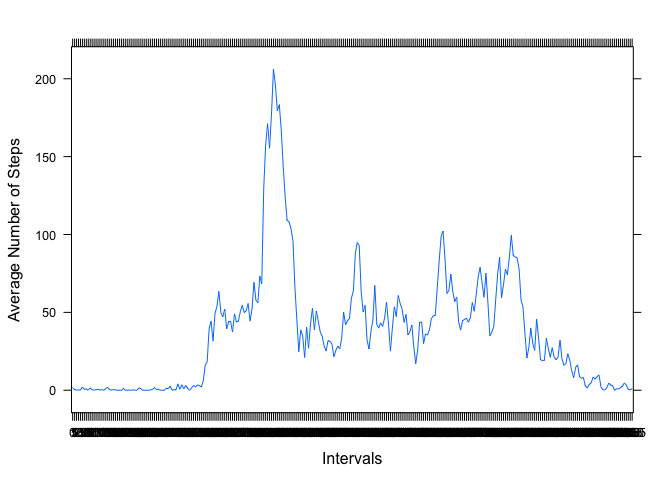
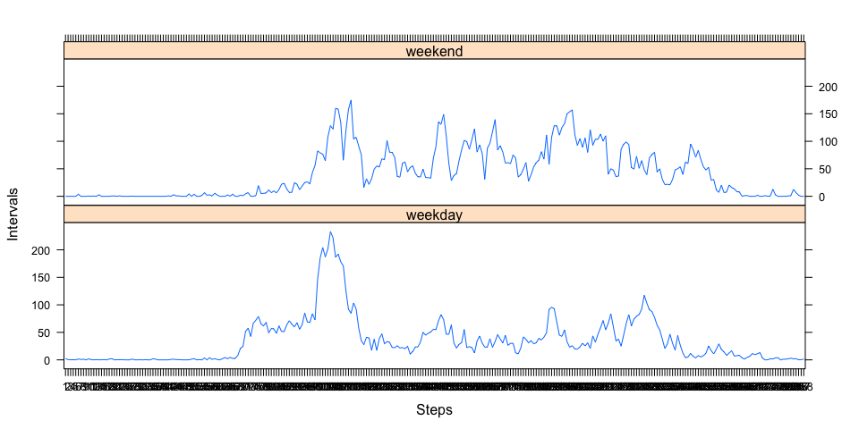

# Reproducible Research: Peer Assessment 1
WeiHsi Hu  
19 October 2014  
## Introduction

This is an analysis assignment for the Reproducible Research Course on Coursera. This is an analysis of the [Activity monitoring data] (https://d396qusza40orc.cloudfront.net/repdata%2Fdata%2Factivity.zip) from the course website. The data is analysed in R.

## Loading and preprocessing the data


```r
temp <- tempfile()
download.file("http://d396qusza40orc.cloudfront.net/repdata%2Fdata%2Factivity.zip", temp)
activity <- read.csv(unz(temp, "activity.csv"))
unlink(temp)
activity$date <- as.Date(activity$date, format = "%Y-%m-%d")
activity$interval <- as.factor(activity$interval)
```


```r
library(dplyr)
```

```
## 
## Attaching package: 'dplyr'
## 
## The following objects are masked from 'package:stats':
## 
##     filter, lag
## 
## The following objects are masked from 'package:base':
## 
##     intersect, setdiff, setequal, union
```

```r
library(lattice)
stepsSum <- activity %>%
        group_by(date) %>%
        summarise(stpSum = sum(steps))
```

## What is mean total number of steps taken per day?

Histogram of total number of steps taken each day


```r
hist(stepsSum$stpSum, main = "Total Steps Each Day", xlab = "")
```

 


```r
stepsMean <- mean(activity$steps, na.rm = TRUE)
stepsMedian <- median(activity$steps, na.rm = TRUE)
```

The mean of the total number of steps take per day is 37.3826 steps and median total number of steps taken per day is 0 steps.

## What is the average daily activity pattern?

A time series plot of the 5-minute interval and the average number of steps taken.

```r
stepsInt <- activity %>%
        group_by(interval) %>%
        summarise(
                meanSteps = mean(steps, na.rm = TRUE),
                medianSteps = median(steps, na.rm = TRUE))

xyplot(meanSteps ~ interval, data = stepsInt, type = "l", ylab = "Average Number of Steps", 
                    xlab = "Intervals")
```

 


```r
maxInt <- stepsInt[stepsInt$meanSteps == max(stepsInt$meanSteps), 1]
```

On average across all the days in the dataset, the maximum average steps took place at interval 835.

## Inputing missing values


```r
sumNA <- sum(is.na(activity$steps))
```
 
There are in total 2304 rows with NAs.


```r
activityFilled <- data.frame(steps = numeric(), 
                             date = as.Date(character()), interval = numeric())

for(i in 1:length(activity$steps)) {
        if(is.na(activity[i, "steps"])) {
                activityFilled[i, "steps"] <- stepsInt[i, "meanSteps"]
                activityFilled[i, c("date", "interval")] <- activity[i, c("date", "interval")]
                } else {
                activityFilled[i, ] <- activity[i, ]
                }
        }
```


```r
hist(activityFilled$steps, main = "Steps Take Each Day - NA filled")
```

 


```r
stepsMean2 <- mean(activity$steps, na.rm = TRUE)
stepsMedian2 <- median(activity$steps, na.rm = TRUE)
```

The mean of the total number of steps take per day is 37.3826 steps and median total number of steps taken per da y is 0 steps. The mean and median different from part 1 of the estimates. (Part 1 mean is 37.3826 and median is 0).

## Are there differences in activity patterns between weekdays and weekends?


```r
activityFilled <- activityFilled %>%
        mutate(day = as.factor(weekdays(date))) %>%
        mutate(week = as.factor(ifelse(!weekdays(activityFilled$date) %in% c("Saturday", "Sunday"), "weekday", "weekend")))

activityFilled <- transform(activityFilled, interval = factor(interval))


aveActivityWeek <- activityFilled %>%
        group_by(week, interval) %>%
        summarise(
                mean_steps = mean(steps, na.rm = TRUE)
                )
```


```r
xyplot(mean_steps ~ interval|week, type = "l", data = aveActivityWeek, layout = c(1, 2), xlab = "Steps", ylab = "Intervals")
```

 


